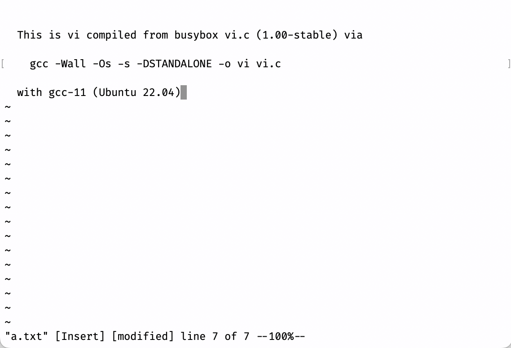

<!DOCTYPE html><html><head><meta charSet="utf-8"/><meta name="viewport" content="width=device-width"/><title>Yanyan&#x27;s Wiki</title><link rel="stylesheet" href="https://cdn.jsdelivr.net/npm/katex@0.16.9/dist/katex.min.css" integrity="sha384-n8MVd4RsNIU0tAv4ct0nTaAbDJwPJzDEaqSD1odI+WdtXRGWt2kTvGFasHpSy3SV" crossorigin="anonymous"/><link rel="stylesheet" href="//cdnjs.cloudflare.com/ajax/libs/highlight.js/11.6.0/styles/default.min.css"/><meta name="next-head-count" content="5"/><link rel="preload" href="/_next/static/css/ee15694256147ebe.css" as="style"/><link rel="stylesheet" href="/_next/static/css/ee15694256147ebe.css" data-n-g=""/><noscript data-n-css=""></noscript></head><body>

<a href="/">Yanyan&#x27;s wiki</a>
<nav class="text-sm leading-6 font-semibold text-slate-700 dark:text-slate-200"><ul class="flex space-x-8"><li><a class="hover:text-sky-500 dark:hover:text-sky-400" href="/OS/2024/">操作系统 (2024 春)</a></li></ul></nav>

<h1>生存指南</h1>

<strong>操作系统是一门十分硬核的编程课</strong>，因此如果你还没有完全准备好开始 “编程”、开始面对别人的代码，那可能你需要细心规划一下你的学习路线。当然，也不必焦虑，一来可能 “没学好编程” 不完全是你的责任，二来万事总有开头：

<blockquote>

<strong>Don&#x27;t Panic.</strong> ——The Hitchhiker&#x27;s Guide to the Galaxy

</blockquote>
<h2>1. 操作系统为什么难学？</h2>

一直以来，老师们觉得《操作系统》课难教的原因主要是其中的主题既多、涉及的知识又深入，点面无法兼得。举个例子，同学们到目前为止编写的大部分代码都是串行的，就好像是写一个程序模仿 “一个人”，一次执行一步动作。通常《操作系统》课都是第一个引入并发编程的课程 (因为操作系统是最早的并发程序)，也就是你需要协同多个共享内存的 “多个人” 时，会遇到很多你也许意料之外的问题。

很显然，你 “想不清” 这个问题——可以预计，人类已经和并发编程的问题肉搏了几十年，时至今日仍有创新。那么，把这个话题 “讲清楚” 自然是极难的。更糟糕的是，很多课程试图把 “牛逼的现代操作系统” 概念放到课程中 (也许是为了装逼)，但这无异于空中楼阁。《操作系统》课要讲清楚的问题包括：

<ul>
<li>操作系统应该为应用程序提供怎样的 API？</li>
<li>如何用硬件实现多个进程的并发/并行？</li>
<li>如何编写能够工作的并发程序，它不会在压力负载下随时随地崩溃？</li>
<li>如何维持多个隔离的执行流？</li>
<li>如何在磁盘上实现持久的数据结构？</li>
<li>……</li>
</ul>

在解决这些问题上作出突出贡献的人已经得过 n 个图灵奖了——每一个问题都不是吃素的。我们的课程试图把这些问题的来龙去脉、解决方法、代码实现都掌握好，已经相当有挑战性。

操作系统 “难学” 的另一个原因是，想要理解 “操作系统为什么要做成今天这样”，就需要相当的应用编程经验——很多在你有了编程经验后 “理所应当” 的事情，在还不会编程的时候就显得很生硬。某位资深教师曾经问我：“copy-on-write fork 为什么需要引用计数？” 我一时语塞：如果一个共享资源可以自由共享，除了 gc 和引用计数，就没有简单明了的方法去释放它了。这一部分是因为我们的课程设置 “高不成低不就”：

<widget class="quiz-card">
❓ <!-- -->第一门编程课的职责是
<ol><li class="hover:cursor-pointer hover:bg-slate-200">学会用 API 把内心所想用代码表达出来并且爱上编程</li><li class="hover:cursor-pointer hover:bg-slate-200">深入理解一门编程语言的语法和语义，向语言律师迈进一步</li><li class="hover:cursor-pointer hover:bg-slate-200">引导学生取得学分，卷得 GPA</li></ol></widget>

如果你还没有爱上编程，那花一点时间 (包括学习《操作系统》课) 绝对是值得的。现在我们假设大家已经爱上编程，讨论操作系统该怎么学。

<h2>2. 操作系统该怎么学？</h2>
<blockquote>

<strong>Don&#x27;t Panic. Everything is a state machine.</strong> ——The Hitchhiker&#x27;s Guide to Operating Systems

</blockquote>

幸运的是，我们在多年的经验里找到了理解操作系统的三把 “钥匙” (尤其是很特别的第三把钥匙)，从三个视角里，“从外向里” 一点一点深入地观测操作系统，直到形成对操作系统完整、一致的理解。

<h3>🔑-1 <strong>在程序眼中，操作系统 = 对象 + API</strong></h3>
<widget>
操作系统为应用程序提供了执行的基础环境、一系列操作系统对象和操作它们的 API——至少对于今天的操作系统来说，这些东西都是精确定义、触手可及的。我们可以在课堂上通过代码片段、调试工具、日志、trace 等等实在地触摸到操作系统为应用程序提供的一切。这就帮助我们理解现代操作系统<red>设计</red>背后的思路。
</widget>

我们会学习真实操作系统中的程序是什么，以及如何借助操作系统提供的 API 为操作系统编程。具体来说，我们的选择是 Linux (准确来说是 POSIX) 作为课程教学的平台，因为它既免费也自由 (能知道它内部的实现)，而且互联网上有丰富的 (英文) 文档。它的设计继承自 “Keep it simple, stupid” 的 UNIX，这个经典的设计背后的动机反而更容易为第一次接触操作系统的初学者所理解，也会贯穿整个课程。

选择 Linux 的另一个原因是它的开源基础——你能找到 Linux 世界中几乎任何程序的源代码！例如，你是否好奇 “文本编辑器” 是怎样实现的？命令行中的 Vim 看起来很酷，但你可能没有学过实现它所必须的编程知识。一方面，你可以求助 AI，另一方面，你也可以直接找一个 “简化版” 的实现，例如早期 busybox 的 <a href="https://git.busybox.net/busybox/tree/editors/vi.c?h=1_00_stable">vi.c</a>。扫一眼代码，你甚至会发现下面的注释：

<pre><code class="hljs language-c">/* To compile for standalone use:
 *	gcc -Wall -Os -s -DSTANDALONE -o vi vi.c ... */
</code></pre>

看不懂也没关系，我们有人工智能。AI 给了相当好的答案：

<blockquote>

GPT-4-turbo: 这个命令是在使用 GCC (GNU Compiler Collection) 编译器编译一个名为 <code>vi.c</code> 的C语言源文件，并生成一个名为 <code>vi</code> 的可执行文件。命令中的各个选项含义如下：<code>-Wall</code>: 开启所有的警告信息，帮助开发者发现代码中可能的问题。<code>-Os</code>: 优化编译后的代码，使其在大小上进行优化，即尽可能减小生成的可执行文件的大小。<code>-s</code>: 去除符号表和调试信息，这也有助于减小最终可执行文件的大小。<code>-DSTANDALONE</code>: 定义一个宏 <code>STANDALONE</code>，这通常用于条件编译。在源代码中，可以使用 <code>#ifdef STANDALONE</code> 来检查这个宏是否被定义，从而决定是否编译某些特定的代码块。<code>-o vi</code>: 指定输出的可执行文件名为 <code>vi</code>。综上所述，这个命令的目的是编译 <code>vi.c</code> 文件，并生成一个优化过的、体积较小的、没有调试信息的 <code>vi</code> 可执行文件。

</blockquote>

这个文件也许比你写过的任何项目都大 (4000 行)，但你如果使用正确的工具把函数代码折叠起来，你会发现这简单，你也写得出，而且它包含了实现 “命令行图形界面” 的必要代码，例如如何移动光标、如何清除屏幕等，你依葫芦画瓢也能写出来！Standalone 编译可能会遇到一些小麻烦 (但如果你有好的编程基础，不用怕，你可以解决这些小问题)，一旦解决了一些未定义的函数问题，你就真的得到了一个可以编译运行的文本编辑器：

没错。我们就是通过编写各种有趣的实际程序理解操作系统为应用程序提供的对象和 API——在这些对象和 API 上构建了我们肉眼可见的一切：浏览器、编辑器、游戏、游戏外挂、虚拟机……包括为了帮助大家更好地理解操作系统的 API，我们还设置了若干 Linux 系统上的 Mini Programming Labs，每个 200 行左右的代码，实际调用 Linux 操作系统 API 完成一些仅使用 C 标准库难以办到的任务。

<h3>🔑-2 <strong>在硬件眼中，操作系统 = C 程序</strong></h3>
<widget>
如果你完全理解了操作系统中有什么对象、如何操纵它们，就只剩一个问题：你能用计算机硬件提供的机制把这些对象和 API 实现出来吗？实际上，运算和访存指令、I/O、中断/异常和虚存就是我们实现操作系统所需的全部。<red>实现</red>操作系统就是硬件和体系结构知识基础上的普通 “编程活”。
</widget>

从我们初学编程开始就知道，我们的代码从 main 函数开始执行，下面的程序能打印出 Hello World:

<pre><code class="hljs language-c">int main() {
  for (const char *p = &quot;Hello World\n&quot;; *p; p++) {
   putchar(*p);
  }
}
</code></pre>

一模一样的代码，能直接在没有操作系统的硬件上运行，并且打印出 Hello World 吗？答案是肯定的——前提是我们需要做好一系列的准备：AI 也给出了 “需要做什么” 的正确答案：

<ol>
<li><strong>启动代码 (Bootloader)</strong>：在没有操作系统的硬件上，你需要一个启动加载程序 (bootloader) 来初始化硬件并加载你的程序到内存中。</li>
<li><strong>硬件初始化</strong>：你的程序需要包含初始化硬件的代码，比如设置堆栈、初始化中断向量表、配置时钟、设置内存管理单元等。</li>
<li><strong>直接硬件访问</strong>：你需要编写代码直接与硬件通信，比如通过内存映射的I/O或特殊的硬件寄存器来发送字符到串行端口、LCD显示屏或其他输出设备。</li>
<li><strong>自定义输出函数</strong>：由于标准库函数如 <code>putchar</code> 不可用，你需要编写自己的输出函数来替代它，这个函数将直接与你选择的输出硬件接口交互。</li>
</ol>

没错！我们的确需要编写一些 “底层代码”，一旦编写完成 (也不用害怕，我们会为同学们提供友好的代码框架)，我们的 “操作系统” 就完全可以用 C 语言编写了。事实上，UNIX 自诞生以来，就不断有人在实现新的操作系统——一个成功的例子就是 Linux，在它之上还有或许更为成功的 Android。UNIX 也有更多 “迷你版” 的替代实现，能容易地帮助大家理解代码背后的原理。我们在课堂上选用 <a href="http://pdos.csail.mit.edu/6.S081/xv6">xv6-riscv</a> 作为讲解操作系统的例子。同时，大家也需要在 Operating System Labs 中，从 “裸机” (bare-metal) 编程开始，自底向上实现一个支持多处理器、文件系统、虚拟存储的迷你操作系统内核。

<h3>🔑-3 <strong>在上帝眼中，操作系统 = 一个数学对象</strong></h3>
<widget>
这也是我们多年以来找到最有趣的视角：我们可以把计算机系统 (电路) 建模成有限状态机模型，当然也可以把运行在硬件上的任何软件 (包括操作系统) 建模成状态机。这个视角不仅可以给我们带来许多有趣的思想实验，也指导我们真正把 “数学对象” 实现出来，并用代码自动分析和<red>理解</red>它们。
</widget>

我们从小到大学过很多数学，我们习惯于 <math xmlns="http://www.w3.org/1998/Math/MathML"><semantics><mrow><mi>y</mi><mo>=</mo><mi>sin</mi><mo>⁡</mo><mo stretchy="false">(</mo><mi>x</mi><mo stretchy="false">)</mo></mrow><annotation encoding="application/x-tex">y = \sin(x)</annotation></semantics></math>y=sin(x) 这样的 “函数”。但 “函数” 的定义发生了微妙的变化：我们可以在 <code>main</code> “函数” 里调用 <code>printf()</code> 打印，因此计算机世界中的函数，和数学世界中的函数就很难被联系起来了。

从另一个角度，数学的视角又总是伴随着我们的计算机程序。例如，我们可以把编译器想象成一个，它接受一个程序 <math xmlns="http://www.w3.org/1998/Math/MathML"><semantics><mrow><mi>P</mi></mrow><annotation encoding="application/x-tex">P</annotation></semantics></math>P 作为输入，而 <math xmlns="http://www.w3.org/1998/Math/MathML"><semantics><mrow><mi>C</mi><mo>=</mo><mi>f</mi><mo stretchy="false">(</mo><mi>P</mi><mo stretchy="false">)</mo></mrow><annotation encoding="application/x-tex">C = f(P)</annotation></semantics></math>C=f(P) 得到编译后的二进制代码。同样，我们也可以把计算机想象成一个数学函数，如果把所有内存、寄存器的数值想象成一个巨大的数字 <math xmlns="http://www.w3.org/1998/Math/MathML"><semantics><mrow><mi>x</mi></mrow><annotation encoding="application/x-tex">x</annotation></semantics></math>x，计算机每执行一条指令，就会得到 <math xmlns="http://www.w3.org/1998/Math/MathML"><semantics><mrow><msup><mi>x</mi><mo mathvariant="normal" lspace="0em" rspace="0em">′</mo></msup><mo>=</mo><mi>f</mi><mo stretchy="false">(</mo><mi>x</mi><mo stretchy="false">)</mo></mrow><annotation encoding="application/x-tex">x&#x27; = f(x)</annotation></semantics></math>x′=f(x)，即 “执行指令之后的计算机状态”。

如果我们的计算机系统和程序都是数学对象，我们能不能像研究数学对象一样 (例如，证明 <math xmlns="http://www.w3.org/1998/Math/MathML"><semantics><mrow><mi>f</mi><mo stretchy="false">(</mo><mi>x</mi><mo stretchy="false">)</mo><mo>=</mo><msup><mi>x</mi><mn>2</mn></msup></mrow><annotation encoding="application/x-tex">f(x) = x^2</annotation></semantics></math>f(x)=x2 相对于 <math xmlns="http://www.w3.org/1998/Math/MathML"><semantics><mrow><mi>y</mi></mrow><annotation encoding="application/x-tex">y</annotation></semantics></math>y 轴对称)，证明关于计算机程序和系统的数学性质？答案是肯定的。我们将在这门课中用通俗的方式引入 “形式化方法”，而这个视角最终将帮助我们更严格地理解计算机系统地方方面面。

<h3>迈出第一步</h3>

如果你还没有入门，仍然感到恐惧，请记住：坚持住，进入未知领域，<red><strong>从简单的、能理解的东西试起，投入时间，就有收获</strong></red>。<a href="References.md">参考资料</a>中有一些非常棒的入门材料，例如 “Harley Hahn&#x27;s Guide to Unix and Linux”，引人入胜 (这本书不是写给计算机专业人士的，所以它异常好读且有中文版)。从这里开始，你就能慢慢克服恐惧了。

同样，你可能会对一小段程序 (例如课堂上的示例代码) 感到难以理解。程序难读是很正常的——但程序的运行时状态是好理解的。无非就是数字和指针嘛。请你勇敢地打开你的调试器，设置一个断点，单步执行你的程序。不知道怎么调试？调试的时候没有代码？做好阅读互联网资料的准备，也准备好你身边的 AI 助手，然后现在就开始吧！

<h3>3.2 自测：C 语言编程</h3>
直到今天这门课依然使用 C 语言。在阐述操作系统原理方面，它更简单、包袱更少，也没有很庞大的工具链。虽然说这相当于 “把你的手脚捆起来编程”，但我们通常不需要很复杂的数据结构和代码逻辑，因此现代语言特性的好处在大部分时候并不显著。而且用 C 语言还有一些额外的好处：
<ul>
<li>和其他编程语言相比，C 语言特性更容易真正掌握和深入理解。如果你没有学好，用几周的时间补上应该也没问题</li>
<li>C 是一种 “高级的汇编语言”，你不难在大脑里把 C 出代码翻译成指令序列；但对于现代语言来说，这要困难得多</li>
<li>透过对 C 语言的深入理解，可以更好地理解现代编程语言的设计动机和实现方法</li>
</ul>
一个例子是 “面向对象”，我们在 C 里也可以实现
<pre><code class="hljs language-c">struct foo {
  int (*bar)(struct foo *this, int a, int b); // 函数指针
};

void baz() {
  struct foo *ptr = get_object();
  ptr-&gt;bar(ptr, 3, 4);
  // 等效于C++: ptr-&gt;bar(3, 4)
}
</code></pre>
而 C++ 里的对象，的确也是这样 (类似) 实现的。如果要实现动态绑定 (用父类的指针调用子类的方法)，我们只需把虚函数的入口放到一张表中，通过查表得到函数实际的入口地址：
<pre><code class="hljs language-c">struct object_header {
  void **vptr;
};

struct foo {
  struct object_header header;
  ...
};

void baz {
  struct foo *ptr = get_object();
  // ptr-&gt;bar(3, 4), dynamic binding
  // INDEX_OF_BAR在编译时由编译器确定
  (int (*)(void *, int, int)) (ptr-&gt;header.vptr[INDEX_OF_BAR]) (ptr, 3, 4);
}
</code></pre>
能理解上述的例子，说明你已经有相当扎实的 C 语言基础了。如果不能，建议大家阅读参考书中推荐的 “The C programming language”。
<blockquote>
<h4>思考题：多重继承</h4>

C++ 支持多重继承，即一个类可以拥有两个父类。你想到多重继承的实现方法了吗？多重继承的实现是把多个父类同时嵌入进来 (会拥有两个 <code>header</code>)。编译器会处理好调用、动态绑定等问题。

从写 C 程序的角度 (操作系统也就是个运行在计算机硬件上的 C 程序)，所谓 “编程” 不过是用那些编程语言提供的机制，把内存里的数据取出来，算一算，再放回去。There is <em>no</em> magic in computer systems.

</blockquote>
只有在泥潭里摸爬滚打很多年，死了一次又一次，才能体会 C++11/14/17/20+, Rust, Go 等现代程序设计语言的良苦用心。
<h3>3.3 自测：编程技巧</h3>
选修过《计算机系统基础》，或是任何开发过相当规模项目的的同学一定已经经历过调试 bug 的噩梦。无数次你打算放弃 (或者实际放弃)，或选择不要某个 labs/PA 的成绩，或选择抱大腿同学的实现……你们做出的妥协都可以理解，但在这个过程中忽略的调试经验，只会让你们在调试越来越大系统的时候越来越吃力。

我们的自测问题是：如果你一个很大的项目发现了 bug (假设你可以稳定地重现它)，你应该如何找到出问题的地方所在？
<ul>
<li><code>printf</code> 是个很不错的方法；但你遇到过花费很长时间也没有找到 bug 的情况么？</li>
<li>如果 <code>printf</code> 帮助你找到了一些线索，如何进一步快速确定问题的 root cause？</li>
<li>如果项目很大，使用调试器单步就有些太繁琐了。你有什么技巧？(例如 watch point)</li>
</ul>
如果你对这些问题心里都有一些答案，那祝贺你！如果你一直在使用 “蛮力” 调试，的确有可能过去的代码你还能处理，但对于规模不断增长的代码，这就有些行不通了。
<blockquote>
<h4>思考题：怎样尽可能编出<strong>正确</strong>的代码？</h4>

在 “面向 OJ 编程” 成为习惯以后，编程不过 “是测试 <math xmlns="http://www.w3.org/1998/Math/MathML"><semantics><mrow><mo>→</mo></mrow><annotation encoding="application/x-tex">\to</annotation></semantics></math>→ 不通过 <math xmlns="http://www.w3.org/1998/Math/MathML"><semantics><mrow><mo>→</mo></mrow><annotation encoding="application/x-tex">\to</annotation></semantics></math>→ 修改” 的循环。但如果你希望<strong>说服别人你的代码真的是对的</strong>，你有什么办法吗？

试着提前想一想这个问题。这个学期里，大家会面对多线程并发的编程，这时候程序的正确性就尤为重要，只靠 “盲试” 就有些不够了。

</blockquote><h2>4. 其他常见问题</h2>
Q: <strong>说好的操作系统呢？为什么没有图形界面？？？我是不是学了假的操作系统？？？？</strong>

A: 你如果把终端的每一个字符看成是像素点，那终端也勉强算是个 “图形” 界面了。

实际上，操作系统也是这么管理图形界面的——由一个程序 (可能运行在 GPU 上) 算出每个像素点该显示什么颜色，就像 vi 在终端上显示字符、导航栏一样。当像素点足够小的时候，你就有图形的感觉了：

(<a href="http://ascii-patrol.com/">ASCII Patrol</a>：上面的 “图形” 真的都是 ASCII 字符组成的！)

当然，图形绘制涉及到的知识太多，课程上就不多啰嗦了，假装能完成这个类比，无法假装的同学可以选修著名的 <a href="https://sites.cs.ucsb.edu/~lingqi/teaching/games101.html">Games 101</a>。

Q: <strong>为什么不是C++/Go/Rust/...?</strong>

A: <strong>我们并不需要 “更高级” 的语言，依然可以编写优雅、深刻的代码，这对初学者来说尤为重要，不会 “顾此失彼”</strong>。

好的语言特性使程序变得优雅——但对于初学者，这些特性背后的东西 (例如 C++ RTTI) 可能给你带来未知的麻烦。而在这门课上，退一步并没有什么损失：我们不需要实现什么高级数据结构；用 C 语言也能写出优雅的代码，就像 xv6 那样。还有两点额外好处：
<ul>
<li>C 语言代码始终有非常直白的汇编语言一致性。</li>
<li>通过在 C 语言编程时体会缺失的部分，能更好地理解现代编程语言中的机制。如果你熟悉现代 C++/Rust，你就会对对象的 ownership 非常敏感。即便你在写 C，这种好的思维习惯依然会时刻保护你。如果你想得更远一些，你依然可以在 C 中通过 assertions 近似地表达出 <a href="https://prl.ccs.neu.edu/blog/static/refinement_types_lecture.pdf">Refinement Types</a>。</li>
</ul>
Golang/Rust/C++ 都可以用来实现操作系统，不过似乎现在对大家来说负担稍稍有些重。

Q: <strong>我想退课/蹭课？</strong>

A: 上课可以督促你写好代码。而<strong>不写代码这门课就白上了</strong>；理解这一点，欢迎蹭课。如果觉得基础没有打好，就先努力学好 C 语言。这门课的唯一要求就是<strong>会使用 C 语言编程</strong>，还有<strong>能读懂手册</strong>。

Q: <strong>我想做纯理论。代码什么的关我️✖️事？</strong>

A: 有那个智力和坚持，写点 C 代码真是太简单了。花一点时间去理解写代码的关键，顺利完成课程不是问题；计算机系统/编程语言领域也有许多和理论交叉的课题。

Q: <strong>我还是好怕。</strong>
A: Don&#x27;t Panic。不要慌，在 Office Hours 的时候来聊一聊。

<a rel="license" href="http://creativecommons.org/licenses/by-nc/4.0/">Creative Commons License: BY-NC 4.0</a> <a href="https://beian.miit.gov.cn/">苏 ICP 备 2020049101 号</a>

</body></html>